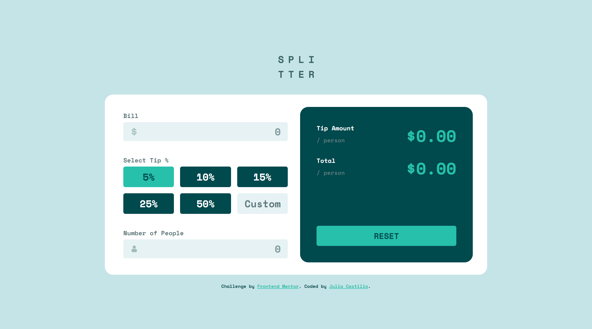
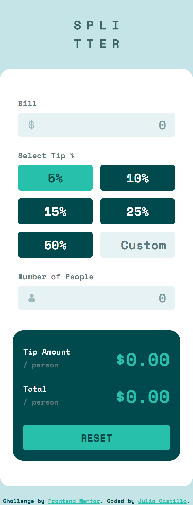

# Frontend Mentor - Tip calculator app solution

This is a solution to the [Tip calculator app challenge on Frontend Mentor](https://www.frontendmentor.io/challenges/tip-calculator-app-ugJNGbJUX). Frontend Mentor challenges help you improve your coding skills by building realistic projects.

Started on 27/09/2021.

Finished on 29/09/2021.

Approx time spent on it: 6.5 hours.

## Table of contents

- [Overview](#overview)
  - [The challenge](#the-challenge)
  - [Screenshot](#screenshot)
  - [Links](#links)
- [My process](#my-process)
  - [Built with](#built-with)
  - [What I learned](#what-i-learned)
- [Author](#author)

## Overview

### The challenge

Users should be able to:

- View the optimal layout for the app depending on their device's screen size
- See hover states for all interactive elements on the page
- Calculate the correct tip and total cost of the bill per person

### Screenshot

### Links

- Solution URL: [Solution URL here](https://www.frontendmentor.io/solutions/tip-calculator-using-css-grid-and-js-fETEm7Esd)
- Live Site URL: [Live site URL here](https://juliacastillo.github.io/FM-tip-calculator-app/)

## My process

### Built with

- Semantic HTML5 markup
- CSS custom properties
- Flexbox
- CSS Grid
- Mobile-first workflow

### What I learned

- More practice using CSS Grid
- The CSS pseudo-class :focus-within
- Styling an HTML input element

## Author

- Website - [Add your name here](https://www.your-site.com)
- Frontend Mentor - [@JuliaCastillo](https://www.frontendmentor.io/profile/JuliaCastillo)

